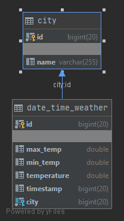

# Open-weather-map service
Open weather map service used for showing the forecast of predefined cities for next 5 days.

Forecast can be queried by specific dates and cities, as well as show the average for the given period for each of the cities.

Examples of the currently supported API's and queries can be found on [swagger page](http://localhost:8080/swagger-ui.html) while application is running.

## Setup local environment

* Create new MySQL database scheme on the local machine, Named by configuration file property: currently - open-weather-map
* Make sure credentials are valid for configuration setup: currently - user: root, pass: root
* Application will run on the predefined configuration port: currently - 8080

## Swagger

* Swagger is available at http://localhost:8080/swagger-ui.html

## High level architecture

Current architecture goal is to have it as close as possible to clean architecture design, with basic DDD (Domain Drive Development) practices.
It is even valid to try, and make services into use-case containers with their heavy logic.

General idea is to have domain models, and they should be used in all the services. This would make the whole internal isolated from API (controller), 3rd party, database and other layers. All the services would communicate on the same layer and this would make data mapping much easier.

Domain models should have as much restriction as possible, preventing unwanted changes of their fields and states.

DTO models should only be visible to controller, keeping the corresponding services clean. In the current implementation, WeatherService does have dto-like communication, but it is put inside the api package, meaning, if api changes, so will the service. Rest of the services, such as City and DateTimeWeather are kept clean from dto classes and only communicate with primitive properties or domain classes.

Finally, repository specific models could and should be made, but due to low level of complexity, they were omitted in the current example.

Factory has been proposed for mapping domain to dto's and vice versa.

## Database scheme

Due to time constraint, it is currently only supported city search by their names. With a current setup, adding another field for city specific ID's that are available on [Open weather map - City Id's](http://bulk.openweathermap.org/sample/) should not be big problem and can be implemented down the road.

Each of the cities has its name mapped for them, and each can contain multiple DateTimeWeather entities attached to them. Each DateTimeWeather contains timestamp that represents time and date for witch temperatures have been predicted and recorded, temperature that represents its current value, and minimal and maximal values as well. Currently, min and max values have not been used, but they can have their own set of algorithmic values down the line, hence the reason for their saving.

## Testing

Application contains only Unit tests, that are independent of the application context, allow for their execution without the need of database, or any third party connections.

For services, @ExtendWith(MockitoExtension.class) was used for mocking and injecting.

For controllers, @WebMvcTest(MyController.class) and @AutoConfigureMockMvc were used.

Not all test cases have been covered, but all the important edge cases and examples have been written and shown. Implementation for coverage goal of around 80% is straightforward solution.

## Improvements

Additionally, solution and application can be published in docker or cloud service provider for easier testing and accessibility.

IT was not done currently due to time constraints.

Pageable implementation has been left out, but its initial implementation can be found on pageable-support branch.

## Development

[Intellij](https://www.jetbrains.com/idea/) as IDE has been used with [google style guide](intellij-java-google-style.xml) ([source](https://github.com/google/styleguide)). 
